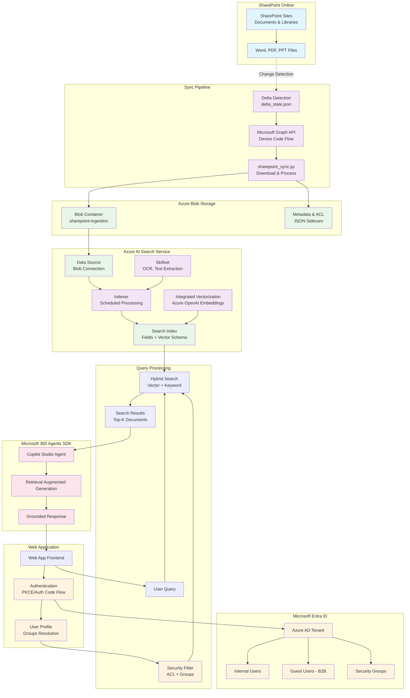
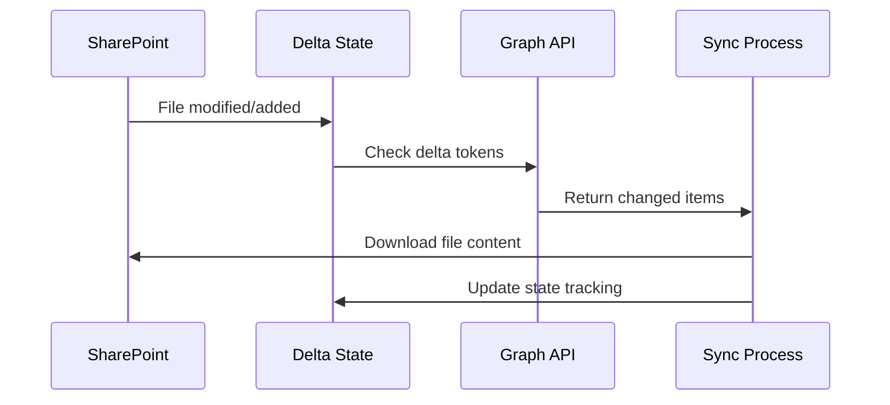
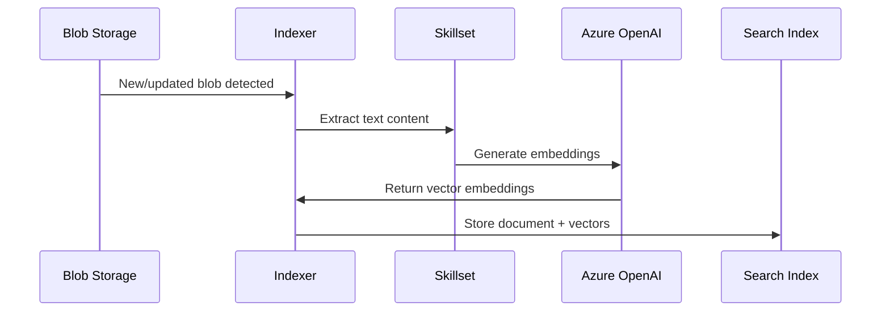
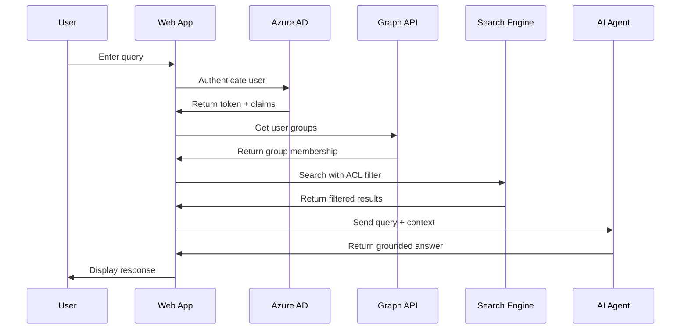

# SharePoint AI Search Sync - Architecture Diagram

## Complete System Flow



## Key Integration Points

### 1. **Change Detection Flow**


### 2. **Indexing Pipeline**


### 3. **User Query Flow**


## Security & Permissions Model

```mermaid
graph LR
    subgraph "Document ACL Storage"
        DOC[Document]
        ACL[ACL Field<br/>["group1", "group2", "Everyone"]]
        DOC --> ACL
    end
    
    subgraph "User Context"
        USER[User Login]
        TOKEN[Access Token]
        GROUPS[User Groups<br/>["group1", "group3"]]
        USER --> TOKEN
        TOKEN --> GROUPS
    end
    
    subgraph "Query Filter"
        FILTER[search.in(acl, 'group1,group3')]
        MATCH[Document Accessible]
        NOMATCH[Document Filtered Out]
    end
    
    ACL --> FILTER
    GROUPS --> FILTER
    FILTER --> MATCH
    FILTER --> NOMATCH
```

## Component Responsibilities

| Component | Primary Function | Key Files |
|-----------|------------------|-----------|
| **Sync Pipeline** | Change detection & file staging | `sharepoint_sync.py`, `main.py` |
| **Search Setup** | Index/indexer provisioning | `azure_search_setup.py`, `azure_search_integrated_vectorization.py` |
| **Configuration** | Settings management | `config/settings.py` |
| **Diagnostics** | Debugging & validation | `debug_*.py`, `check_*.py`, `explore_*.py` |
| **State Management** | Delta tracking | `delta_state.json` |

## Why Internal + Guest Users Work Seamlessly

1. **Unified Identity**: Both use Entra ID tokens with object IDs
2. **Group Membership**: Guests can be assigned to same security groups
3. **ACL Resolution**: Same group-based filtering logic applies
4. **Token Validation**: Azure AD handles authentication uniformly
5. **Agents SDK**: Operates on authenticated context regardless of user type

## Scaling Considerations

- **Blob Storage**: Handles large document volumes
- **Search Service**: Scales indexing and query workloads independently  
- **Vectorization**: Integrated pipeline eliminates separate embedding service
- **Caching**: Delta state prevents redundant processing
- **Security**: Group-based filtering scales with organizational structure